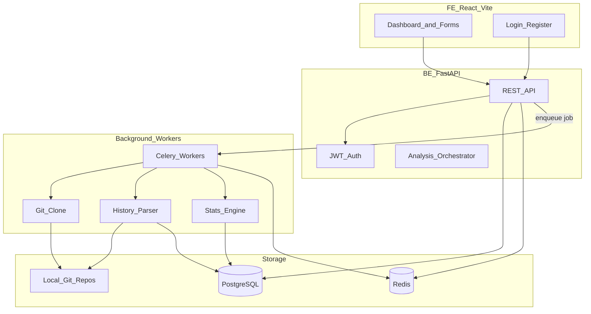
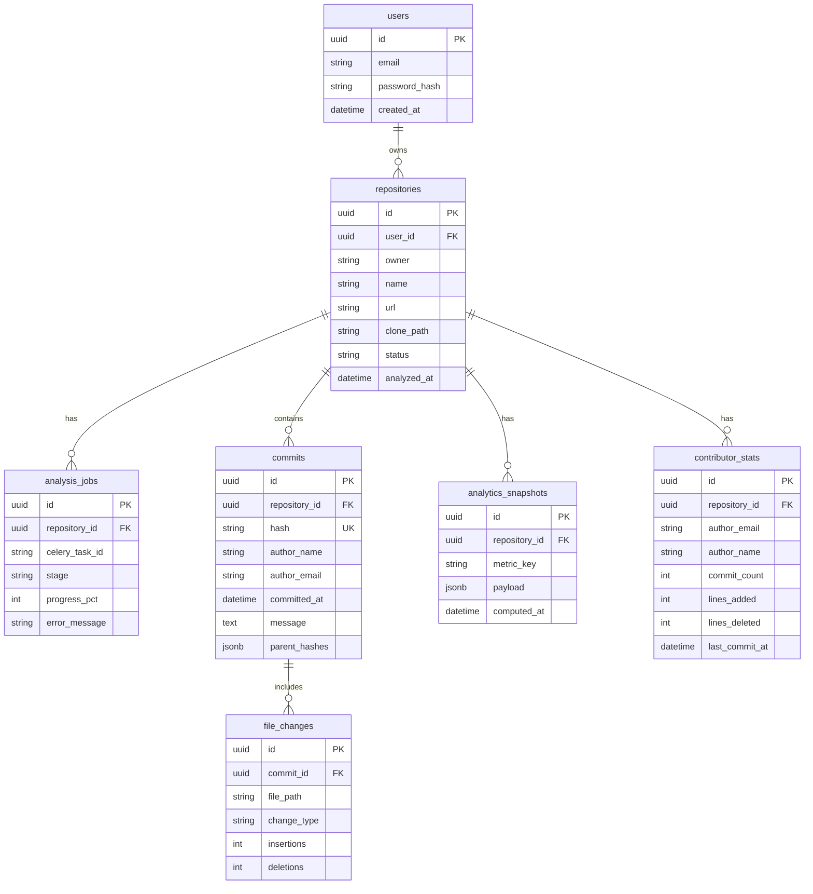
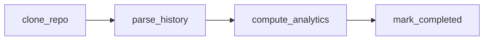

# GitHub Repository Analytics — Master Plan

- **BE repo:** `github-analytics` (this repo)
- **FE repo:** separate repo, not started yet

---

## Objective

Build an application that accepts a public GitHub repository URL, analyzes its **entire Git history locally** (no GitHub API required for core analytics), persists structured results, and answers questions like:

- Who writes the most code?
- Which files change the most?
- Which contributor hasn't committed in months?
- How many commits happen every week?
- Which files are most unstable?
- Which folders are growing fastest?
- What is the bus factor?

The user experience: submit URL → immediate "Analysis started" response → background processing → refresh dashboard when complete.

---

## High-Level Architecture



---

## Repository Split

| Concern | BE repo (`github-analytics`) | FE repo (TBD) |
|---------|------------------------------|---------------|
| Git clone & parse | Yes | No |
| Statistics computation | Yes | No |
| PostgreSQL models | Yes | No |
| Celery tasks | Yes | No |
| REST API | Yes | Consumes only |
| JWT issuance/validation | Yes | Stores token, sends in headers |
| Charts & tables | No | Yes |
| Repo URL form, job status polling | No | Yes |

---

## Tech Stack

### Backend
- **Python 3.12+**
- **FastAPI** — REST API, OpenAPI docs, dependency injection
- **SQLAlchemy 2.0** — ORM, sync sessions to start
- **Alembic** — migrations
- **PostgreSQL** — primary datastore
- **Redis** — Celery broker + result backend + job status cache
- **Celery** — background clone/parse/analyze pipeline
- **GitPython** or **pygit2** — read Git objects
- **Pydantic v2** — request/response schemas
- **passlib + PyJWT** — password hashing + JWT
- **pytest + httpx** — API and unit tests
- **Docker Compose** — local dev (api, worker, postgres, redis)

### Frontend
- **React 18 + Vite + TypeScript**
- **React Router** — routing
- **TanStack Query** — API data fetching, polling for job status
- **Recharts** — activity graphs, bar charts
- **Tailwind CSS** — styling
- **Zod + React Hook Form** — form validation

### CI/CD (both repos, later)
- **GitHub Actions**: lint → test → build Docker image
- BE: `ruff`, `pytest`
- FE: `eslint`, `tsc`, `vitest`

---

## Core Pipeline (5 Steps)

### Step 1 — Register repository (sync, fast)

User POSTs `https://github.com/owner/repo`. API stores metadata only:

```
repositories: id, owner, name, url, clone_path, status, user_id, created_at
status: pending | cloning | parsing | analyzing | completed | failed
```

No Git work yet beyond URL validation.

### Step 2 — Clone (async Celery task)

Clone into `/data/repos/{owner}/{name}/`. Update `status → cloning → parsing`.

**Clone strategy:** full clone before analytics ship (shallow history breaks commit-walking).

### Step 3 — Parse Git history (async, chunked)

```python
for commit in repo.iter_commits():  # default branch in v1
    store: hash, author_name, author_email, committed_at, message, parent_hashes
    for diff in commit.diff(parents):
        store: file_path, change_type (A/M/D/R), insertions, deletions
```

**Git internals:**
- Commits are nodes; parents form a **DAG** (directed acyclic graph)
- Merge commits have 2+ parents → graph traversal
- Trees and blobs hold file snapshots; diffs are computed between trees

**Performance:** batch-insert commits (e.g. 500 rows per transaction). Report progress in Redis.

### Step 4 — Calculate statistics (async)

Run aggregations over stored data. Store precomputed results in `analytics_snapshots`.

### Step 5 — Serve results (sync API)

Dashboard reads snapshots — never re-walks Git on page load.

---

## Database Schema (PostgreSQL)



**`analytics_snapshots.payload` examples:**

| metric_key | payload shape |
|------------|---------------|
| `commits_per_week` | `[{week: "2024-W01", count: 42}, ...]` |
| `top_contributors` | `[{name, email, commits, lines_changed}, ...]` |
| `top_modified_files` | `[{path, change_count, churn_score}, ...]` |
| `folder_growth` | `[{path, commits_first_half, commits_second_half, growth_rate}, ...]` |
| `inactive_contributors` | `[{name, last_commit_at, days_inactive}, ...]` |
| `bus_factor` | `{score: 1, top_contributor_pct: 0.72}` |
| `summary` | `{total_commits, total_contributors, first_commit, last_commit, avg_commits_per_day}` |

---

## Analytics Definitions

| Question | How to compute | Data structure |
|----------|----------------|----------------|
| Most active contributor | Count commits per `author_email` | Hash map → heap for top-K |
| Most modified files | Count `file_changes` per `file_path` | Hash map |
| Inactive contributors | `now - max(committed_at)` per author | Hash map + date math |
| Commits per week | `GROUP BY date_trunc('week', committed_at)` | SQL aggregation |
| Unstable files | High change frequency + churn in rolling window | Weighted score |
| Fastest-growing folders | Compare folder commits: first half vs second half of repo lifetime | Tree aggregation |
| Bus factor | Smallest set of contributors ≥ 50% of commits | Greedy / sort |
| Largest commits | Order by `insertions + deletions` | SQL `ORDER BY` |

---

## Algorithms Map

| Algorithm / structure | Where used |
|----------------------|------------|
| **DAG traversal** | Walking commit history |
| **Hash map (dict)** | Author → commit count, file → change count |
| **Heap** | Top-K contributors/files |
| **Tree (Trie)** | Directory/folder aggregation |
| **Time-series bucketing** | Weekly/daily commit charts |
| **Greedy** | Bus factor calculation |

---

## REST API Design

Base path: `/api/v1`

### Auth
| Method | Path | Description |
|--------|------|-------------|
| POST | `/auth/register` | email + password → user created |
| POST | `/auth/login` | → `{access_token, token_type}` |
| GET | `/auth/me` | current user (JWT required) |

### Repositories
| Method | Path | Description |
|--------|------|-------------|
| POST | `/repositories` | `{url}` → create repo + enqueue analysis |
| GET | `/repositories` | list user's repos with status |
| GET | `/repositories/{id}` | repo metadata + summary |
| DELETE | `/repositories/{id}` | remove repo + data + clone dir |
| POST | `/repositories/{id}/reanalyze` | re-run pipeline |

### Analysis
| Method | Path | Description |
|--------|------|-------------|
| GET | `/repositories/{id}/status` | `{status, stage, progress_pct, error}` |
| GET | `/repositories/{id}/analytics/{metric}` | single metric snapshot |
| GET | `/repositories/{id}/analytics` | all snapshots |

### Conventions
- JWT in `Authorization: Bearer <token>`
- `202 Accepted` on analysis start
- `409 Conflict` if repo already exists for user

---

## Background Processing (Celery)



- Broker/backend: Redis
- Progress in `analysis_jobs` + Redis `job:{id}:progress`
- On failure: `status=failed`, store `error_message`

---

## Authentication

### v1 — Email/password + JWT
- bcrypt password hashing
- JWT with `sub=user_id`, `exp=24h`
- `Depends(get_current_user)` on protected routes

### v2 — GitHub OAuth (later)
- Sign in with GitHub
- Encrypted token for private repo clone

---

## Backend Project Structure (target)

```
github-analytics/
├── plan.md
├── docker-compose.yml
├── Dockerfile
├── pyproject.toml
├── .env.example
├── alembic/
├── app/
│   ├── main.py
│   ├── config.py
│   ├── api/
│   │   ├── deps.py
│   │   └── v1/
│   ├── core/
│   ├── models/
│   ├── schemas/
│   ├── services/
│   ├── git/
│   ├── analytics/
│   └── workers/
└── tests/
```

**OOP boundaries:**
- `GitRepositoryCloner` — clone logic
- `GitHistoryParser` — iterates commits
- `AnalyticsEngine` — metric calculators via ABC/protocol
- `RepositoryService` — business logic between API and DB

---

## Implementation Phases

### Phase 0 — Project scaffolding (BE)
- `pyproject.toml`, FastAPI app with `GET /health`
- `app/config.py` (pydantic-settings), folder structure
- Docker Compose (API, Postgres, Redis)
- Alembic + SQLAlchemy `Base` + `get_db` wired (no models yet)
- `.env.example`, `.gitignore`, README setup steps

### Phase 1 — Auth
- User model, register/login endpoints, JWT dependency
- Tests for auth flow

### Phase 2 — Repository registration
- POST `/repositories` stores URL, parses owner/name
- GET list/detail — no Git yet, status stays `pending`

### Phase 3 — Git clone (Celery)
- `GitRepositoryCloner`, volume mount, status transitions
- Job progress in DB + Redis

### Phase 4 — History parser
- Walk commits, persist `commits` + `file_changes`
- Progress reporting for large repos

### Phase 5 — Analytics engine
- Metric calculators, write to `analytics_snapshots` + `contributor_stats`

### Phase 6 — Analytics API
- Endpoints to read snapshots, complete OpenAPI

### Phase 7 — Frontend
- React + Vite + TypeScript (separate repo)
- Auth, dashboard, add repo, detail page with charts

### Phase 8 — Hardening
- Full clone, re-analyze, delete repo, error handling, rate limiting

### Phase 9 — GitHub OAuth (optional)
- OAuth flow, private repo support

### Phase 10 — CI/CD
- GitHub Actions for both repos

---

## Key Technical Decisions

| Decision | Choice |
|----------|--------|
| Git access | GitPython first |
| Clone type | Full clone before v1 release |
| API versioning | `/api/v1` prefix |
| Precompute vs query | Precompute into snapshots |
| Multi-branch | Default branch only in v1 |
| Auth | Email/password + JWT first; GitHub OAuth later |

---

## Risks and Mitigations

| Risk | Mitigation |
|------|------------|
| Huge repos take hours to parse | Progress UI, document expectations |
| Disk space | Configurable `REPOS_BASE_PATH`, delete clone on repo delete |
| Duplicate author names/emails | Normalize by email; show name aliases in UI |
| Celery task failure mid-parse | Transactional batches, `status=failed`, reanalyze wipes partial data |
| JWT secret exposure | `.env` file, never commit secrets |
